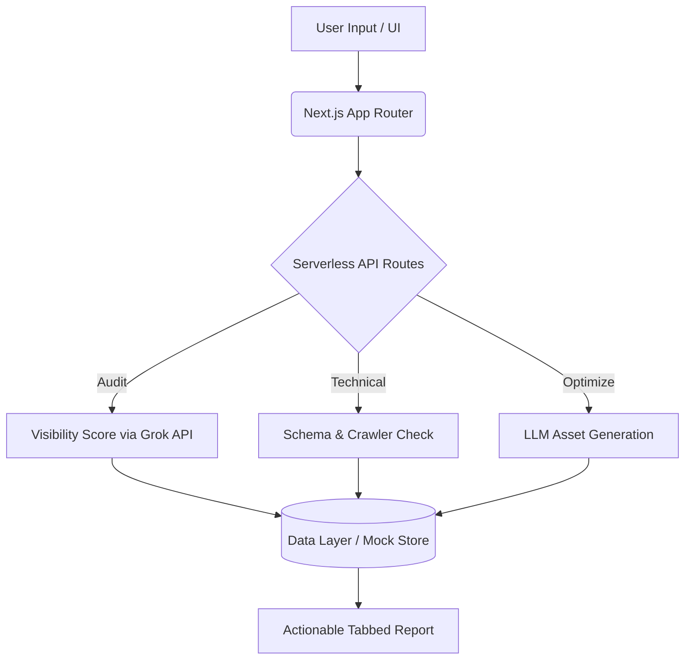

# GEO-Pulse: Generative Engine Optimization Agent

GEO-Pulse is a lightweight, production-ready web application designed to audit and boost brand visibility across AI search engines (ChatGPT, Perplexity, Gemini, Claude, and Grok). 

As traditional SEO shifts toward **Generative Engine Optimization (GEO)**, brands must ensure their content is structured properly for Large Language Models (LLMs) to extract and cite. GEO-Pulse automates this entire process.

---

## 🎯 What it Does
1. **AI Visibility Scoring:** Probes the Grok API to measure a brand's AI Share of Voice (SOV) and tracks which AI search engines are actively citing the brand's domain.
2. **Technical & Schema Audits:** Simulates website scraping to detect valid JSON-LD structured data and verifies if AI crawlers (like `OAI-SearchBot` or `ClaudeBot`) are blocked by `robots.txt`.
3. **GEO Content Transformation:** Utilizes elite semantic LLM analysis to rewrite standard webpage text into highly factual, subject-verb-object structured "summary boxes" that LLMs prioritize for direct extraction (featured snippets).

## 👥 Who it is Built For
- **SEO Professionals & Agencies:** Looking to transition their clients from traditional Google rankings to LLM visibility.
- **Brand Managers & PR Teams:** Needing to measure their brand's sentiment and citation frequency across AI platforms.
- **Content Strategists & Marketers:** Needing automated guidance on what "long-tail conversational questions" users are asking AI so they can fill content gaps.

---

## 🏗️ Architecture

The application is built for blazing fast performance, utilizing a decoupled architecture to easily swap between mock data and production databases.



### Tech Stack
* **Framework:** Next.js (App Router, Server Components)
* **Language:** TypeScript
* **Styling:** Tailwind CSS + Custom accessible UI Components (inspired by shadcn/ui) + Lucide Icons + Recharts
* **LLM Integration:** xAI Grok API (`api.x.ai`)
* **State/Persistence:** Decoupled In-Memory JSON Mock Layer (storing state in `globalThis` across API contexts, ready for Prisma/PostgreSQL).

---

## 🚀 Getting Started

### 1. Environment Setup
Create a `.env.local` file in the root of the project and add your Grok API key:
```env
GROK_API_KEY=xai-your_api_key_here
```

### 2. Installation
Install the project dependencies:
```bash
npm install
```

### 3. Run Locally
Start the local Next.js development server:
```bash
npm run dev
```
Open [http://localhost:3000](http://localhost:3000) to view the Dashboard and initiate an AI visibility audit!
